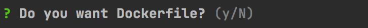
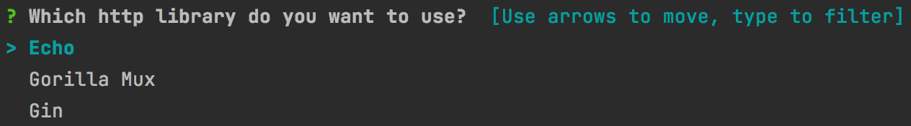

<h1 align="center">gotouch</h1>
<p align="center">


<a href="https://github.com/denizgursoy/gotouch/issues" target="_blank"></a>
</p>

gotouch easy way to create go projects.

Install, run on CLI, make your selections and start development.

<p align="center">
<a href="https://asciinema.org/a/515980" target="_blank"></a>
</p>

## Installation

```bash
go install -v github.com/denizgursoy/gotouch/cmd/gotouch@latest
```

### Features

- Choose from go project templates
- Easily install your dependencies and packages

# How to customize
Follow the steps below to create your properties yaml. The suggested way to share files, your template project, and the properties yaml is to
host them in a git repository and use the [raw URL](https://www.howtogeek.com/wp-content/uploads/csit/2021/11/0ad2a42a.png?trim=1,1&bg-color=000&pad=1,1) of the files in the properties yaml.

1. [Create your template project](#Create-your-template-project)
2. [Write your properties yaml file](#Write-your-properties-yaml-file)
3. [Share your properties yaml with the others](#Share-your-properties-yaml-with-others)

## Create your template project

Template is a zip file that has your directories and files inside.Template can be created
with [package command](#package-subcommand). Files inside a template can
have [actions](https://pkg.go.dev/text/template#hdr-Actions) which will be [templated](https://pkg.go.dev/text/template)
with the [values](#values). As an example, If you have `Port` key in your [values](#values), `{{ .Port }}` will be
replaced with the corresponding value.

``` go
package main

import (
	"io"
	"log"
	"net/http"
)

func main() {
	http.HandleFunc("/", getRoot)
	log.Fatalln(http.ListenAndServe(":{{ .Port }}", nil))
}

func getRoot(w http.ResponseWriter, r *http.Request) {
	io.WriteString(w, "Server got the request\n")
}
```

You can also use other go template library's capabilities such as conditions, iterating array values etc. For more
information see [go template library](https://pkg.go.dev/text/template).

## Write your properties yaml file

Properties yaml is a **list** of what we call `Project Structure` as it can be seen below:

```yaml
- name: Empty Project Layout #mandatory - used for displaying project in listing
  reference: https://go.dev/ #optional - is appended to name while prompting project name
  url: https://github.com/denizgursoy/go-touch-projects/raw/main/compressed/empty.zip #mandatory - url of template project
  values: # optional
    Port: 8080
  questions: #optional
    - direction: Do you want Dockerfile? #mandatory
      canSkip: true #if true, there must be at least one choice. 
      choices:
        - choice: Yes
          files:
            - url: https://raw.githubusercontent.com/denizgursoy/go-touch-projects/main/Dockerfile
              pathFromRoot: Dockerfile
          values:
            isDocker: true
```

A Project Structure has name, reference, url, list of [question](#Question) and [values](#values).

After creating your template project, it should be hosted in a http server and url must be address of your template
project. Gotouch downloads the template from the url and uncompress it.

#### Question

Question allows your users to customize their projects. A question must have a direction and choices. Gotouch prompts
user to make a [choice](#choice) for every question in the selected Project Structure.

If a question has only one choice and `canSkip` is true, it is evaluated as Yes/No question

Example Yes/No question:

```yaml
questions: #optional
  - direction: Do you want Dockerfile? #mandatory
    canSkip: true #if true, there must be at least one choice. 
    choices: #mandatory
      - choice: Yes
        files:
          - url: https://raw.githubusercontent.com/denizgursoy/go-touch-projects/main/Dockerfile
            pathFromRoot: Dockerfile
```

Yes/No will be displayed like:



If there are choices more than one, Gotouch will prompt user to select form list of choices. If can skip is true, user
will have `None of above` choice as well.

Example select question:

```yaml
questions:
  - direction: Which http library do you want to use?
    choices:
      - choice: Echo
        dependencies:
        - github.com/labstack/echo/v4
      - choice: Gorilla Mux
        dependencies:
        - github.com/gorilla/mux
      - choice: Gin
        dependencies:
        - github.com/gin-gonic/gin
```

Select question will be displayed like:



#### Choice

If selected, a choice can create files, add dependencies and introduce new values. 

Dependencies are list of string. If version of a dependency is not written Gotouch will append `@latest` and execute `go get`. 

A choice can create files
with address of source file, or content. A file entry must have `pathFromRoot` value is the location of the file inside
project.

Creator of this yaml might want to customize project if a specific choice is selected, so values written under a choice
will be appended to general [value](#values). Values of choice cannot be changed by the user.

A choice can be written like:

```yaml
- choice: Yes
    dependencies:
      - github.com/labstack/echo/v4
    files:
      - url: https://raw.githubusercontent.com/denizgursoy/go-touch-projects/main/Dockerfile
        pathFromRoot: Dockerfile
      - content: "My input"
        pathFromRoot: input.txt
    values:
      httpLibrary: echo
```

### Values

If you want some part of the source code not to be hardcoded, you can define custom values under the `Project Strcuture`.
The most common cases can be port numbers, service addresses, and some configuration values etc. Gotouch will ask user to change the values if he/she wants.

Values under Project Structure will be merged with selected choices' values.

Apart from these values, you can use following predefined values :

```
ModuleName: Module name user typed
ProjectName: Project directory name
WorkingDirectory: location where Gotouch command is executed
ProjectFullPath: Projects full path which is actually WorkingDirectory / ProjectName
```

## Share your properties yaml with others

If you share your properties yaml with us, we can add it to [list](./List.md) so that other people can use it.


# Commands

### gotouch command

`gotouch --file path-to-yaml`

gotouch command uses [properties yaml](#Write-your-yaml-file) file for prompting user to enter name and select project
structure. If file flag value is not provided, it is going to
use [default properties yaml](https://github.com/denizgursoy/go-touch-projects/blob/main/properties.yaml). Firstly,The
command asks for project name. Project name is written to go module and used for directory name.

### package subcommand

`gotouch package --source path-to-source --target path-to-target`

Package command compresses the source directory with the zip extension and moves the zip file to target directory.
`source` and `target` flags are optional. Default values for `source` and `target` are `./`, `../` respectively.

### validate subcommand

`gotouch validate --file path-to-yaml`

Validate checks if your yaml is valid or not. 

